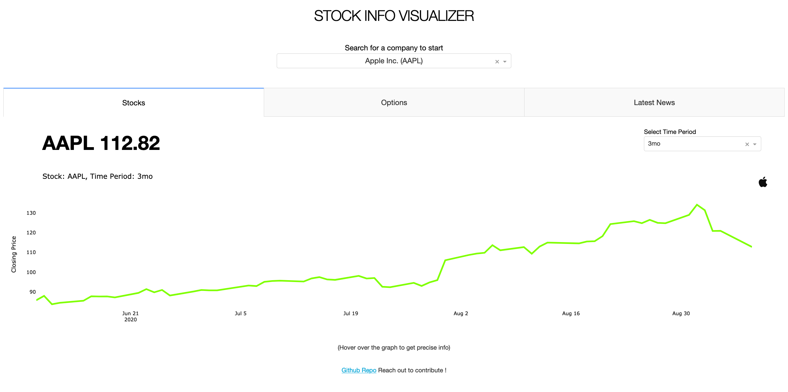
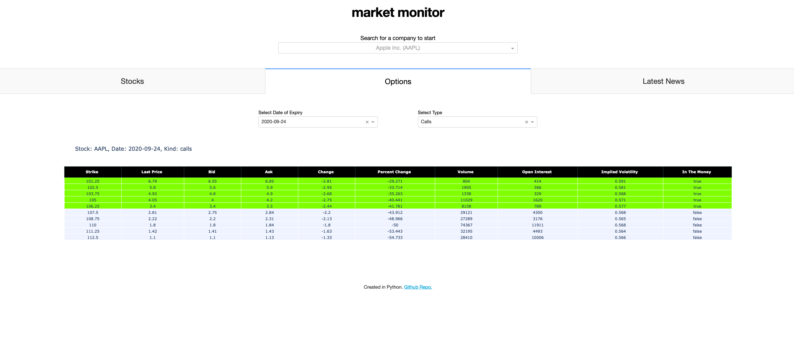
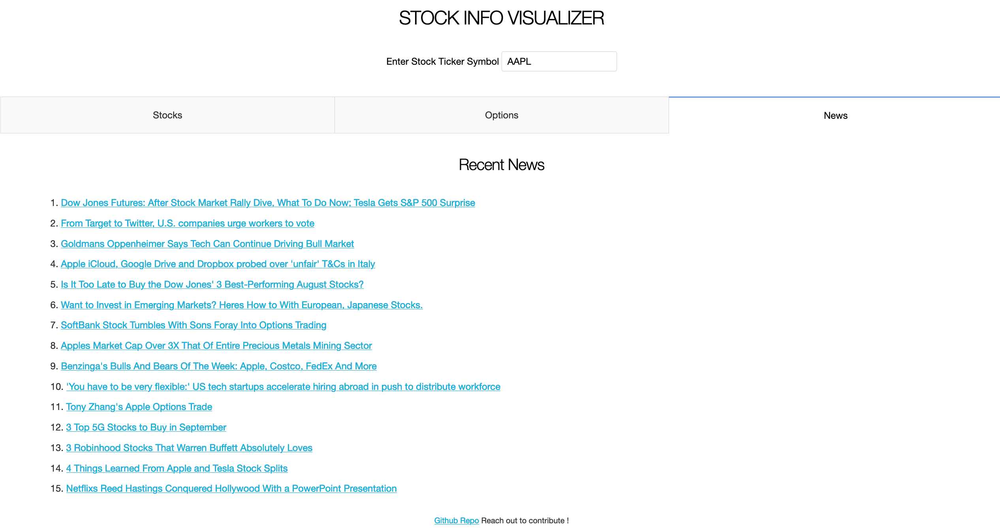

# market-monitor

Welcome to github repo of the [market-monitor app](https://stock-app-vk94.herokuapp.com/). Created completely in Python.

This is a simple app which 
- Let's user choose a stock/company/ETF from NYSE and NASDAQ exchanges
- shows prices across a chart with customizable time periods (1d/1mo/3mo/1y/2y/5y/10y/ytd)
- shows ptions info table closest to stock price with color codes (green-ITM, white-OTM)
- any recent news about the underlying organization

Its updated live and uses the [yfinance](https://pypi.org/project/yfinance/), [finviz](https://github.com/mariostoev/finviz) API in backend.

Feel free to contribute through PR or raise issues. Leave a star if you like the work :)

## Stocks

## Options

## News

